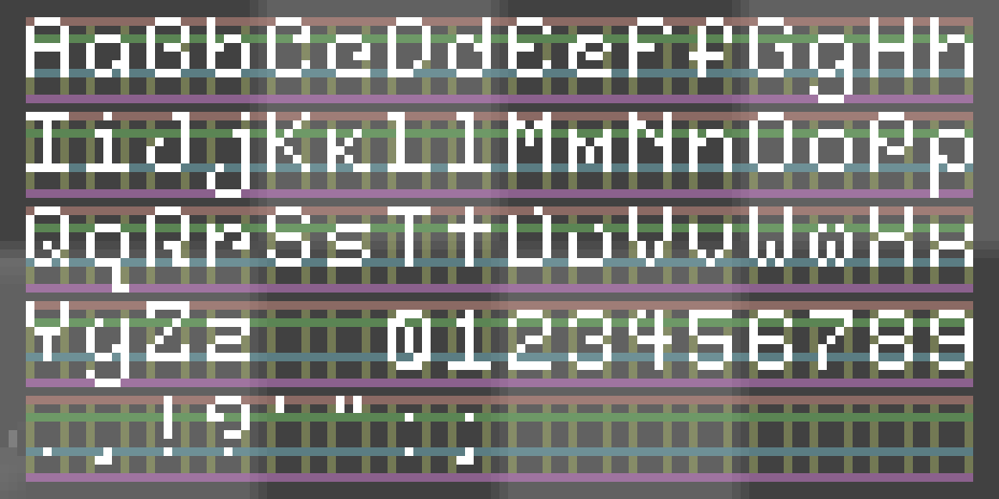

# Bitroot

> [!NOTE]
> **This project is a prototype and doesn’t have a stable release yet. Design and features are subject to change.**

**Bitroot** is a low-resolution blocky typeface I created in [Aseprite](https://www.aseprite.org/) and converted to scalable font files using [PixelFont](https://yellowafterlife.itch.io/pixelfont). 

It's a crisp look and stays readable even at small sizes!

## Specifications

  

Each character fits within a **tiny 5×10-pixel area**, with the **baseline 7px from the top**. Capital letters use the **full 7px height**, while lowercase letters have a **5px x-height** measured upward from the baseline.

**Ascenders** like `b`, `d`, `f`, `h`, `k`, and `l` extend to match the capital height, while descenders (`g`, `j`, `p`, `q`, and `y`) drop **3 pixels below** the baseline into the lower space.

All alphanumeric characters maintain a **consistent 5px width** for perfect alignment. Symbols and punctuation marks vary in width based on what looks best for each character.

## Contributing

Please use imperative, properly cased commit messages (e.g., "Add glyph for ampersand").

### Workflow

1. Edit `bitroot-typeface.aseprite` in [Aseprite](https://www.aseprite.org/)
2. Export the updated font sheet as `font-sheet.png` at 100% scale
3. Import `font-sheet.png` into [PixelFont](https://yellowafterlife.itch.io/pixelfont) and load settings from `pixelfont-settings.json`
4. Generate the font in scalable TTF format
5. Submit a PR with the updated `.aseprite` file, font files, and JSON (if modified)

> [!TIP]
> **Aseprite is paid software ($19.99 USD), but since the source code is available on GitHub, it can built and installed for free!**
> 
> **[Click here for releases and build instructions.](https://github.com/aseprite/aseprite/releases)**

## License

This font is licensed under the [SIL Open Font License 1.1](LICENSE.txt).