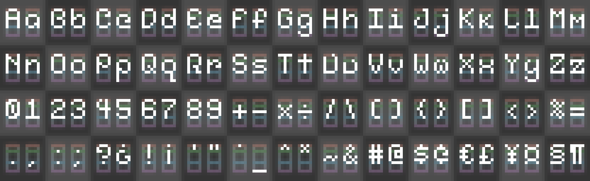

# Bitroot

> [!NOTE]
> **This project is a prototype and doesn’t have a stable release yet. Design and features are subject to change.**

**Bitroot** is a low-res blocky typeface that I put together in [Aseprite](https://www.aseprite.org/), then exported it to [PixelFont](https://yellowafterlife.itch.io/pixelfont) to generate scalable font files.

 It’s a crisp look for video games and stays readable even at small sizes.

## Specifications

  

The characters are packed into a **tiny 5×10-pixel area**, **baseline 7 pixels down from the top**! **Capital letters** use up the full **7-pixel height**, meanwhile regular **lowercases** occupy a **5-pixel x-height** measured from the baseline upward.

However, **ascenders** like `b`, `d`, `f`, `h`, `k`, and `l` stretch to match the capitals and **descenders**, `g`, `j`, `p`, `q`, and `y` drop **3 pixels below the baseline** into the remaining lower space. 

All the **alphanumeric characters** stick to a nice **5-pixel width** so everything lines up perfectly. **Symbols** and **punctuation** get to be a bit more flexible depending on what looks good!

## Contributing

Use imperative, properly cased commit messages (e.g., "Add glyph for ampersand").

### Workflow

1. Edit `bitroot-typeface.aseprite` in [Aseprite](https://www.aseprite.org/)
2. Export updated font sheet as `font-sheet.png` (scale as 100%)
3. Pick the image `font-sheet.png` on [PixelFont](https://yellowafterlife.itch.io/pixelfont) and import settings via `pixelfont-settings.json`
4. Generate the font as scalable `ttf` format
5. Submit PR with updated `bitroot-typeface.aseprite`, font files, and JSON (if modified)

> [!TIP]
> **Aseprite is paid software ($19.99 USD), but since the source code is available on GitHub, it can built and installed for free!**
> 
> **[Click here for releases and instructions.](https://github.com/aseprite/aseprite/releases)**

## License

This font is under [SIL Open Font License 1.1](LICENSE.txt)